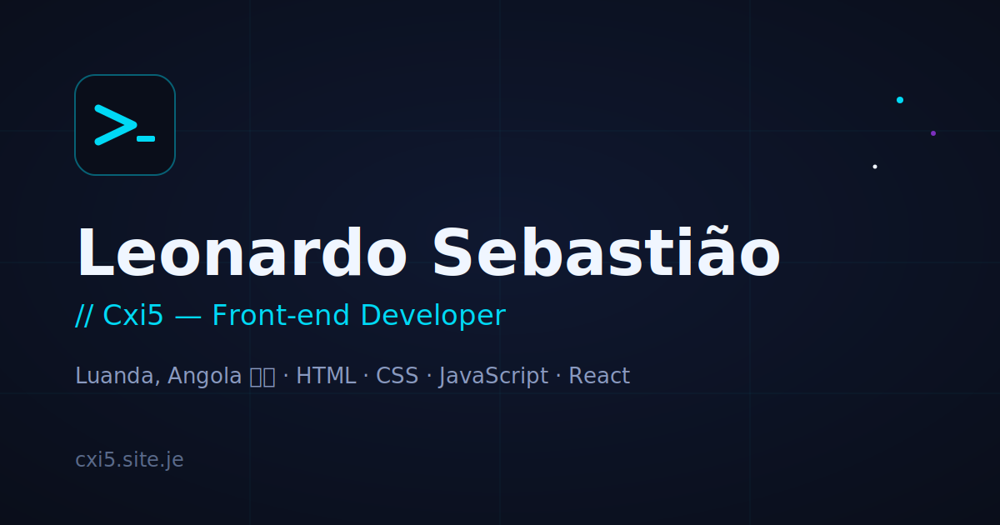

  

<!-- PORTUGUÊS -->

  <a href="https://cxi5.site.je">
    
  <h1>Leonardo Sebastião</h1>
  <h3>Cxi5 [cxi5.site.je] (https://cxi5.site.je)</h3>

  

  
<strong>Front-end Developer</strong> · Luanda, Angola

  
Disponível para projetos freelance

   

  
  
  

    

  

---

### Sobre mim

Sou **Leonardo Sebastião**, também conhecido como **Cxi5**. Programador front-end baseado em Luanda, Angola.

Desenvolvo sites, páginas e landing pages modernas com atenção real à qualidade do código. Gosto de pegar numa ideia e levá-la até ao fim — do primeiro esboço ao produto pronto a usar, com atenção aos detalhes que fazem a diferença entre "funciona" e "funciona bem".

Aplico princípios de **Engenharia de Software** em cada projeto: organização, arquitetura clara, código legível e decisões técnicas conscientes. Não entrego apenas interfaces — entrego bases sólidas para o que vem a seguir.

- Localização: Luanda, Angola  
- Foco: Front-end com capacidade Full Stack  
- Disponível para: projetos freelance e colaboração remota  
- Portfólio: [cxi5.site.je](https://cxi5.site.je)

---

### Engenharia de Software aplicada

| Princípio | Como aplico nos projetos |
|-----------|--------------------------|
| Clean Code | Nomes claros, funções pequenas e responsabilidade única |
| Arquitetura | Separação de responsabilidades e estrutura previsível |
| Versionamento | Commits organizados, branches e histórico legível |
| Qualidade | Atenção a performance, acessibilidade e manutenção |
| Escalabilidade | Decisões técnicas pensadas para crescer sem dívida desnecessária |
| Entrega | Do protótipo ao produto utilizável, com foco no resultado real |

---

### Princípio da pilha

< p align = "center" >
  < img src = " https://img.shields.io/badge/HTML5-E34F26?style=for-the-badge&logo=html5&logoColor=white " / >​ 
  < img src = " https://img.shields.io/badge/CSS3-1572B6?style=for-the-badge&logo=css3&logoColor=white " / >​ 
  < img src = " https://img.shields.io/badge/JavaScript-F7DF1E?style=for-the-badge&logo=javascript&logoColor=black " / >​ 
  < img src = " https://img.shields.io/badge/React-61DAFB?style=for-the-badge&logo=react&logoColor=black " / >​ 
  < img src = " https://img.shields.io/badge/Tailwind_CSS-06B6D4?style=for-the-badge&logo=tailwindcss&logoColor=white " / >​ 
  < img src = " https://img.shields.io/badge/Node.js-339933?style=for-the-badge&logo=nodedotjs&logoColor=white " / >​ 
  < img src = " https://img.shields.io/badge/Git-F05032?style=for-the-badge&logo=git&logoColor=white " / >​ 

​​

---

### Projetos

| Projeto | Descrição | Estado | Ligação |
|---------|-----------|--------|------|
|  ** Sintonizar **  | Plataforma social para músicos. Feed, perfis, descoberta de artistas e sistema de publicações. | Em desenvolvimento | — |
|  ** NexDoc **  | Plataforma de gestão documental e jurídica. Redação de contratos, assinatura digital, arquivo seguro e painel de acompanhamento processual para escritórios. Pilha: React, Node.js, PDF.js, offline primeiro. | Fase final de testes |  [ Ver projeto ] ( https://cxi5.github.io/nexdoc/ )  |
| **LuxeStay** | PWA de experiência hoteleira. Portal do hóspede com reservas em tempo real, galeria interactiva, serviços in-room, gestão de estadias e sistema de avaliações. Instalável no ecrã inicial. | Produção | — |
| **Soft Soluções** | Site institucional para empresa de assistência técnica em Luanda (FRP/IMEI, reparação mobile, CCTV, redes, PC e criação de sites). SEO local, Schema.org e formulário via WhatsApp. | Em produção — clientes reais | [Ver site](https://softsolucoes.wuaze.com) |
| **Guia do Terminal** | Ebook gratuito e interactivo sobre o terminal Linux. 50 comandos do básico ao avançado, organizados em 6 blocos temáticos. Índice lateral, modo claro/escuro e alternância PT/EN. | Publicado | [Ver projeto](https://cxi5.github.io/terminal-guide/) |

### Contacto

  
  
  
  
  

---

### Filosofia

> "Gosto de pegar numa ideia e levá-la até ao fim — do primeiro esboço ao produto pronto a usar, com atenção aos detalhes que fazem a diferença entre 'funciona' e 'funciona bem'."

 

  

---

### Contact

  
  
  
  
  

### Filosofia

> "Gosto de pegar numa ideia e levá-la até ao fim — do primeiro esboço ao produto pronto a usar, com atenção aos detalhes que fazem a diferença entre 'funciona' e 'funciona bem'."

 
